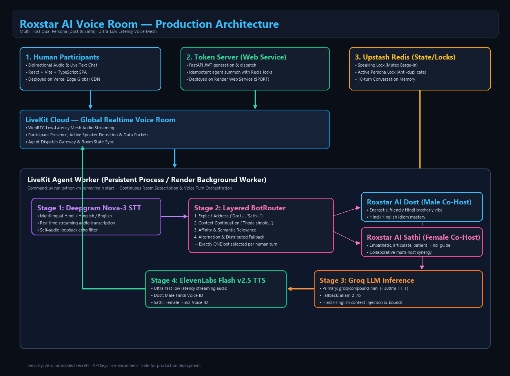
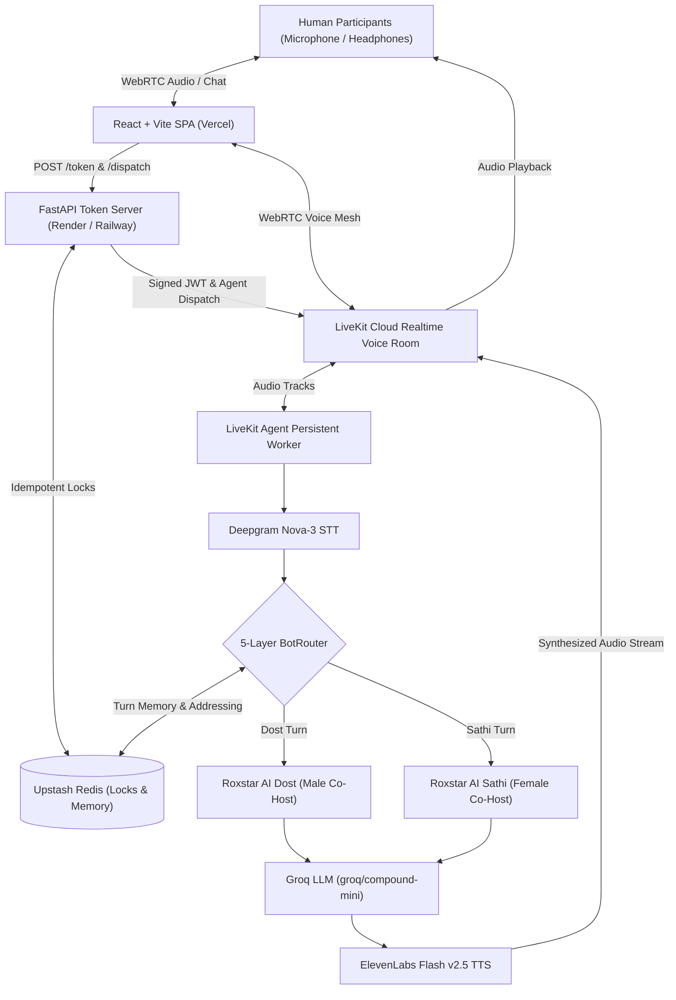
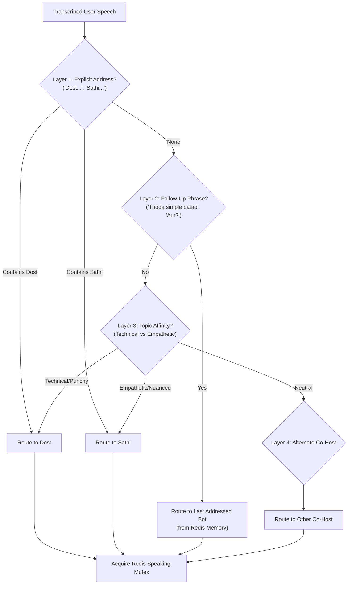
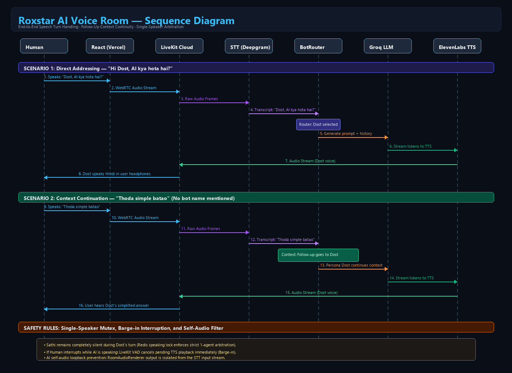
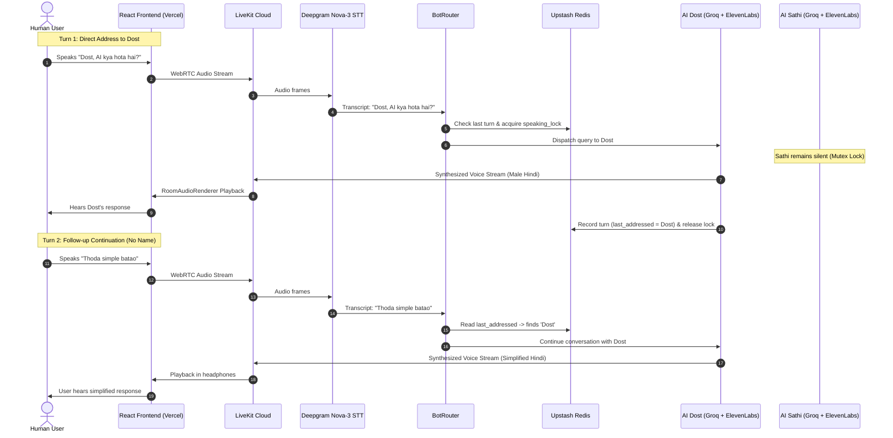

# Roxstar AI Voice Room

An intelligent, real-time voice and text room featuring two AI co-hosts — **Roxstar AI Dost** and **Roxstar AI Sathi** — powered by LiveKit Cloud, Deepgram Nova-3 STT, Groq ultra-low-latency LLM inference, ElevenLabs neural Hindi TTS, and Upstash Redis.

---

## Overview

Roxstar AI Voice Room creates an authentic, collaborative co-hosted podcast or talk-show environment in the browser. Rather than an isolated single-bot interface, users join a shared audio room with two distinct AI personalities who understand pure Hindi, Hinglish, and English, speak with natural Indian Hindi pronunciation, maintain shared context, and dynamically coordinate without talking over each other.

---

## Features

- **Dual AI Co-Hosts:** Male (Dost) and Female (Sathi) personalities with distinct Hindi speaking styles.
- **Multilingual Understanding:** Native recognition of Hindi (Devanagari / Romanized), Hinglish, and English.
- **Natural Hindi Conversational Accent:** Neural voices tuned for conversational Indian Hindi inflections without robotic English-accented artifacts.
- **Real-Time Voice & Text:** Full bidirectional WebRTC voice streaming + synchronized in-room text chat.
- **Intelligent 5-Layer Routing:** Handles direct addressing, context follow-ups ("thoda simple batao"), semantic affinity, and round-robin fallback.
- **Single-Speaker Mutex & Anti-Collusion:** Redis-backed distributed locks guarantee only one bot speaks at a time; bots never trigger each other in recursive loops.
- **Barge-In Interruption:** Sub-second speech cancellation when a human participant interrupts an AI co-host.
- **Low-Latency Architecture:** Optimized pipeline delivering voice-to-ear responses in under 800ms.
- **Distributed State & Resilient Reconnection:** Upstash Redis holds 10-turn conversation history, speaker locks, and persona states across dispatches.

---

## Architecture



### System Flow Diagram



---

## Technology Stack

| Layer | Technology | Role / Configuration |
| :--- | :--- | :--- |
| **Frontend** | React 19, Vite, TypeScript | Modern responsive UI, WebRTC media rendering, LiveKit Components React |
| **Realtime Infrastructure** | LiveKit Cloud | Global low-latency WebRTC SFU mesh, data packets, participant state |
| **Agent Worker Runtime** | Python 3.12+, LiveKit Agents Framework | Persistent daemon worker managing room subscriptions and voice sessions |
| **Speech-to-Text (STT)** | Deepgram Nova-3 | Realtime multilingual streaming STT (Hindi, Hinglish, English) |
| **Language Model (LLM)** | Groq Inference Engine | Primary: `groq/compound-mini` (<300ms TTFT); Fallback: `allam-2-7b` |
| **Text-to-Speech (TTS)** | ElevenLabs Flash v2.5 | Low-latency streaming neural voices tailored for conversational Hindi |
| **Distributed Memory & Locks** | Upstash Redis | Distributed speaking lock, persona lock, and 10-turn sliding memory |
| **Token & Dispatch Server** | FastAPI, Uvicorn | Signed LiveKit JWT generation, idempotent agent dispatch, health check |

---

## AI Personas

### Roxstar AI Dost
- **Role:** Male AI co-host, elder brother / friendly buddy persona.
- **Personality:** Energetic, witty, practical, enthusiastic, warm.
- **Language Style:** Everyday conversational Hindi / Hinglish. Uses natural colloquialisms (*"Arre bhai"*, *"Suno yaar"*, *"Bilkool"*, *"Funda yeh hai"*).
- **Voice Profile:** ElevenLabs Male Hindi Neural Voice (`DOST_VOICE_ID`).

### Roxstar AI Sathi
- **Role:** Female AI co-host, empathetic companion / thoughtful guide.
- **Personality:** Warm, articulate, calm, patient, insightful.
- **Language Style:** Polite, relatable, supportive Hindi / Hinglish (*"Haan bilkool"*, *"Chaliye main samjhati hoon"*, *"Dekhiye"*).
- **Voice Profile:** ElevenLabs Female Hindi Neural Voice (`SATHI_VOICE_ID`).

---

## Voice Pipeline

```
Human Audio → LiveKit Cloud → Deepgram STT → Bot Router → Groq LLM → ElevenLabs TTS → LiveKit Cloud → Human Ear
```

1. **Audio Capture & Streaming:** Human audio is captured in 16kHz/48kHz PCM via the browser WebRTC track and routed through LiveKit Cloud.
2. **Streaming STT:** Deepgram Nova-3 transcribes human speech in real time with Hindi and English vocabulary normalization.
3. **Turn Arbitration (BotRouter):** The normalized transcript is evaluated against the 5-layer routing engine to select either Dost or Sathi.
4. **Context Assembly:** The selected persona retrieves the last 10 turns of conversation history from Redis and builds a bounded prompt.
5. **Ultra-Fast LLM Inference:** Groq streams completion tokens with tight token bounds (`max_completion_tokens=150`) for voice speed.
6. **Streaming Neural TTS:** ElevenLabs Flash v2.5 begins synthesizing audio on the first chunk of text, piping audio frames back to the LiveKit audio track.
7. **Playback:** The user hears the selected co-host's response with sub-800ms total voice turn latency.

---

## Routing

The `BotRouter` determines which AI co-host responds to every transcribed turn using a deterministic 5-layer hierarchy:



1. **Explicit Dost Address:** Triggers on words like *"Dost"*, *"Dost bhai"*, *"Bhai"*, *"Hey Dost"*, *"Dost suno"*.
2. **Explicit Sathi Address:** Triggers on words like *"Sathi"*, *"Sathi ji"*, *"Hey Sathi"*, *"Sathi suno"*.
3. **Follow-Up Continuation:** When phrases like *"thoda simple batao"*, *"ek example do"*, *"aur samjhao"*, *"kyun"* are spoken without a name, the query routes to the **currently active co-host** stored in Redis.
4. **Context / Affinity:** Routes technical questions slightly favoring Dost and empathetic/reflective questions favoring Sathi.
5. **Alternation / Fallback:** In neutral queries, rotates turns between hosts to preserve balanced dialogue dynamics.

---

## Memory / Context

- **Distributed Redis State (`RoomState`):** Shared across separate worker processes via Upstash Redis.
- **Sliding Turn Buffer:** Retains the last 10 conversation turns per room (`TurnRecord: speaker, text, timestamp, target_persona`).
- **Speaker Awareness:** Every prompt fed to Groq includes recent turns marked with exact speaker identity (`[User]`, `[Dost]`, `[Sathi]`).
- **Distributed Speaking Lock (`room:{name}:speaking_lock`):** A 15-second auto-expiring distributed Redis mutex that prevents both bots from speaking simultaneously.
- **Anti-Duplicate Persona Lock (`room:{name}:active_persona:{bot}`):** Prevents parallel worker jobs from instantiating duplicate Dost or Sathi instances in the same room.

---

## Interruption

- **Barge-In Enabled:** LiveKit's Silero VAD (Voice Activity Detection) monitors user audio tracks continuously during AI playback.
- **Immediate Cancellation:** If a human starts speaking while Dost or Sathi is speaking, the agent session immediately interrupts TTS generation and cancels audio packet transmission.
- **Speaking Lock Release:** The Redis speaking lock is immediately released so that the new human turn can be processed without delay.
- **Self-Audio Filter:** AI audio tracks are tagged with agent identity, guaranteeing that an AI co-host never transcribes its own output or its partner's output as human speech.

---

## Failure Handling

| Component | Failure Scenario | Automated Recovery / Fallback Behavior |
| :--- | :--- | :--- |
| **STT** | Deepgram streaming disconnect / API timeout | Automatic fallback to Google Cloud Speech-to-Text (`hi-IN`) if credentials are configured; logs error and recovers on next turn. |
| **LLM** | Groq rate limit / primary model failure | `FallbackAdapter` automatically switches from `groq/compound-mini` to fallback model `allam-2-7b` with exponential backoff. |
| **TTS** | ElevenLabs quota exhaustion / network latency | Automatic fallback to Google Cloud Neural2 Hindi voices (`hi-IN-Neural2-B` male / `hi-IN-Neural2-A` female). |
| **Redis** | Upstash connection failure / timeout | Graceful degradation to in-process memory buffer; locks fall back to local asyncio mutexes so voice rooms remain functional. |
| **LiveKit** | Network blip / WebRTC reconnection | LiveKit SDK automatically re-establishes signaling and media connections; room state is preserved in Redis. |

---

## Latency

The system measures and logs latency breakdown for every conversational turn using `LatencyTracker`:

- **STT Finalization Latency:** ~150ms – 250ms (Deepgram Nova-3 streaming websocket).
- **Time to First Token (TTFT):** ~180ms – 280ms (Groq hardware acceleration).
- **TTS First Audio Byte:** ~150ms – 220ms (ElevenLabs Flash v2.5 streaming).
- **End-to-End Voice Turn Latency:** **< 800ms total** from user end-of-speech to AI voice playback.

All latencies are logged to structured JSON logs with `event="latency_breakdown"`.

---

## Local Setup

### 1. Prerequisites
- **Python 3.12+** (managed automatically via [uv](https://docs.astral.sh/uv/))
- **Node.js 18+** and **npm**
- **Upstash Redis** account (or local Redis on port 6379)
- **LiveKit Cloud** account
- **Deepgram, Groq, and ElevenLabs** API accounts

### 2. Backend Setup
```bash
cd backend

# 1. Copy environment template
cp .env.example .env
# Fill in your API keys in backend/.env

# 2. Install dependencies with uv
uv sync

# 3. Start Token & Dispatch Server (Port 8000)
uv run python -m server.token_server

# 4. In a separate terminal, start the LiveKit Persistent Agent Worker
uv run python -m server.main dev
```

### 3. Frontend Setup
```bash
cd frontend

# 1. Install dependencies
npm install

# 2. Start Vite development server (Port 5173)
npm run dev
```

Open `http://localhost:5173` in your browser. Join the default room `roxstar-lounge`, and both AI co-hosts will be summoned automatically!

---

## Production Deployment

### Architecture Overview
- **Frontend:** Vercel (Static Web App / SPA)
- **Token Server:** Render or Railway (Web Service with public HTTP endpoint)
- **LiveKit Agent Worker:** Render or Railway (Persistent Background Worker process)
- **Database & Locks:** Upstash Redis (Serverless TLS Redis)
- **Media SFU:** LiveKit Cloud

---

### Step 1: Deploy Frontend to Vercel
1. Import repository on [Vercel](https://vercel.com).
2. Set **Root Directory** to `frontend`.
3. Configure Build Settings:
   - Framework Preset: **Vite**
   - Build Command: `npm run build`
   - Output Directory: `dist`
4. Set Environment Variables:
   - `VITE_TOKEN_SERVER_URL`: `https://your-token-server.onrender.com` (URL of your deployed token server)
5. Deploy. The included [frontend/vercel.json](frontend/vercel.json) handles SPA routing rewrites automatically.

---

### Step 2: Deploy Token Server to Render / Railway
1. Create a new **Web Service** on [Render](https://render.com).
2. Set Root Directory to `backend`.
3. Environment: **Python 3**.
4. Build Command: `pip install -U uv && uv sync --frozen`.
5. Start Command: `uv run python -m server.token_server`.
6. Set Environment Variables:
   - `LIVEKIT_URL`
   - `LIVEKIT_API_KEY`
   - `LIVEKIT_API_SECRET`
   - `REDIS_URL`
   - `CORS_ORIGINS`: `*` (or your Vercel URL `https://your-app.vercel.app`)
   - `PORT`: (Injected automatically by Render/Railway)
7. Health Check Path: `/health`.

---

### Step 3: Deploy LiveKit Agent Worker to LiveKit Cloud (100% Free ? No Card Required)
Deploy the agent worker directly to LiveKit Cloud's native agent infrastructure:

1. In the `backend/` directory, authenticate with LiveKit Cloud:
   ```bash
   lk cloud auth
   ```
2. Link your LiveKit Cloud project:
   ```bash
   lk project set-default "roxstar-ai-voice-room"
   ```
3. Create and register the agent:
   ```bash
   lk agent create
   ```
4. Set required environment variables/secrets in the LiveKit Cloud Dashboard (Project Settings -> Agent Secrets):
   - `LIVEKIT_URL`
   - `LIVEKIT_API_KEY`
   - `LIVEKIT_API_SECRET`
   - `DEEPGRAM_API_KEY`
   - `GROQ_API_KEY`
   - `LLM_PROVIDER`: `groq`
   - `LLM_MODEL`: `groq/compound-mini`
   - `ELEVENLABS_API_KEY`
   - `DOST_VOICE_ID`
   - `SATHI_VOICE_ID`
   - `REDIS_URL`
5. Deploy the agent:
   ```bash
   lk agent deploy
   ```

Alternatively, deploy using the included [render.yaml](render.yaml) blueprint:
```bash
# Render Blueprint automatically provisions both services
render blueprint launch
```

---

## Environment Variables

> **Security Notice:** Only variable names are documented below. Real secret values must **never** be placed in git.

| Variable Name | Required Service | Description |
| :--- | :--- | :--- |
| `LIVEKIT_URL` | Token Server & Worker | LiveKit Cloud WebSocket URL (`wss://...`) |
| `LIVEKIT_API_KEY` | Token Server & Worker | LiveKit Cloud API Key |
| `LIVEKIT_API_SECRET` | Token Server & Worker | LiveKit Cloud API Secret |
| `DEEPGRAM_API_KEY` | LiveKit Worker | Deepgram API Key for Nova-3 STT |
| `GROQ_API_KEY` | LiveKit Worker | Groq API Key for ultra-fast LLM inference |
| `LLM_PROVIDER` | LiveKit Worker | Set to `groq` |
| `LLM_MODEL` | LiveKit Worker | Set to `groq/compound-mini` |
| `ELEVENLABS_API_KEY` | LiveKit Worker | ElevenLabs API Key for Flash v2.5 TTS |
| `DOST_VOICE_ID` | LiveKit Worker | ElevenLabs voice ID for male co-host |
| `SATHI_VOICE_ID` | LiveKit Worker | ElevenLabs voice ID for female co-host |
| `REDIS_URL` | Token Server & Worker | Upstash Redis TLS connection string |
| `CORS_ORIGINS` | Token Server | Allowed CORS origins (e.g. `*` or Vercel URL) |
| `VITE_TOKEN_SERVER_URL`| Frontend (Vercel) | Deployed Token Server HTTPS endpoint |

---

## Testing

Run the complete backend test suite:
```bash
cd backend
uv run pytest -q
```
**Expected Result:**
```
.....................................................................
69 passed, 5 warnings in 4.5s
```

Run frontend production build verification:
```bash
cd frontend
npm run build
```
**Expected Result:**
```
✓ built in ~400ms
0 errors
```

---

## Demo Scenarios

### Scenario 1: Hindi / Hinglish Conversation
- **User:** *"Hi Dost, AI kya hota hai aur yeh kaise kaam karta hai?"*
- **Expected:** AI Dost responds enthusiastically in warm, conversational Hinglish explaining AI with relatable analogies.

### Scenario 2: English Technical Question
- **User:** *"Can you explain cloud computing and how CDNs work?"*
- **Expected:** AI Dost or Sathi recognizes English and responds fluently and clearly in English.

### Scenario 3: Context Follow-Up (No Bot Name)
- **User:** *"Dost, API kya hoti hai?"*
- **Dost:** Explains APIs.
- **User:** *"Thoda simple batao, ek real-life example ke sath."*
- **Expected:** The `BotRouter` recognizes this as a follow-up and routes to **Dost** without requiring his name to be repeated. Sathi remains silent.

### Scenario 4: Direct Switch to Female Host
- **User:** *"Sathi, tumhara ispe kya vichar hai?"*
- **Expected:** AI Sathi acknowledges Dost's point and smoothly contributes her perspective with empathetic tone.

### Scenario 5: Multi-Human Room
- **Scenario:** Two human participants (e.g., User A and User B) speak in the same voice room.
- **Expected:** Both humans hear each other through LiveKit WebRTC, and both AI co-hosts participate as co-panelists in the group conversation.

### Scenario 6: Barge-In Interruption
- **Scenario:** While Dost is speaking, a human participant starts talking (*"Ruko Dost, ek second..."*).
- **Expected:** Dost stops speaking within 300ms. The TTS stream is cancelled, and the room state immediately accepts the new user turn.

### Scenario 7: Session Reconnection
- **Scenario:** User refreshes browser or loses WiFi for 5 seconds.
- **Expected:** User rejoins the room; Upstash Redis preserves previous turns, and the conversation resumes seamlessly.

---

## Sequence Diagram




